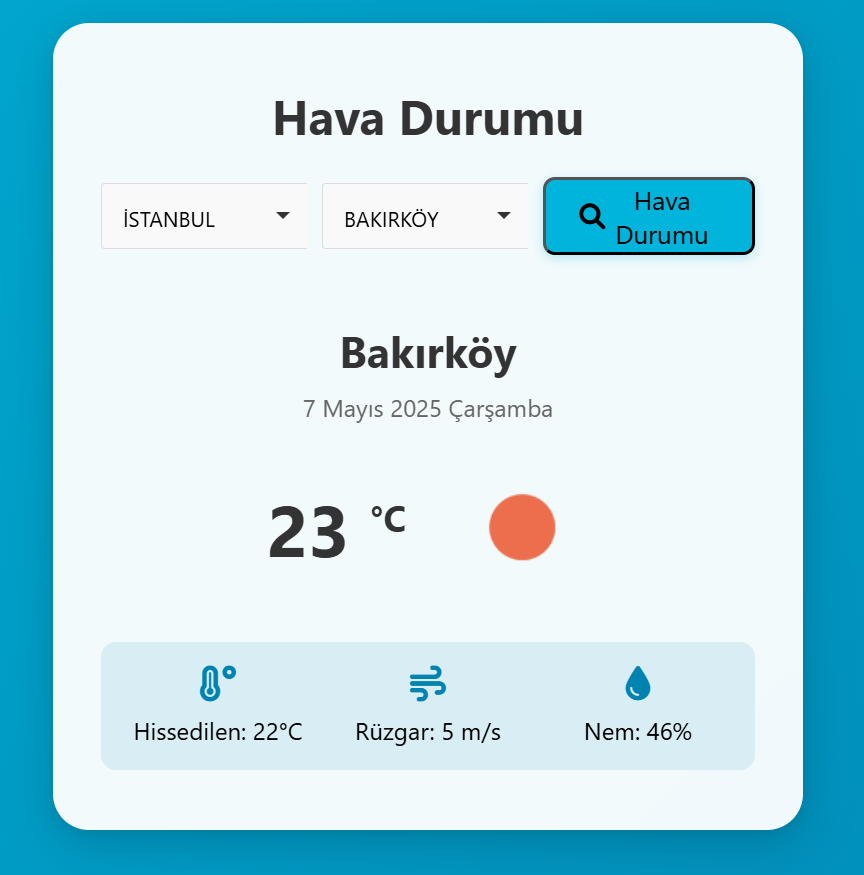

# Hava Durumu Uygulaması

Modern front-end teknikleri kullanılarak geliştirilmiş bir hava durumu uygulaması. OpenWeatherMap API kullanılarak gerçek zamanlı hava durumu bilgilerini gösterir.

## Özellikler

- **İl ve İlçe Seçimi**: Choices.js ile arama destekli, alfabetik sıralı dropdown menüler
- **Gerçek Zamanlı API Çekme**: OpenWeatherMap API üzerinden fetch ve JSON ile dinamik veri işleme
- **Yükleniyor Göstergesi**: API çağrısı sırasında kullanıcıya spinner ile görsel feedback
- **Hata Yönetimi**: Geçersiz ilçe seçimi veya ağ hatası durumunda kullanıcıyı bilgilendiren uyarılar
- **Dinamik Arka Plan**: Hava durumuna göre renkli gradyan arkaplan değişimi
- **OpenWeatherMap İkonları**: API'nin döndürdüğü ikona göre otomatik ikon yükleme
- **Responsive Tasarım**: Mobil ve masaüstü uyumlu, modern ve kullanıcı dostu arayüz
- **Animasyonlu Efektler**: Fade-in geçişler ve hoş gölge efektleri ile akıcı deneyim

## Ekran Görüntüsü

Uygulamanın arayüzü aşağıdaki gibidir:

